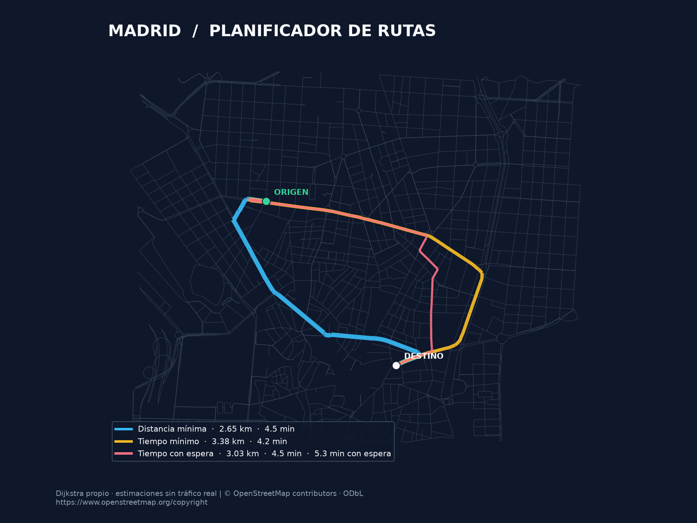

# Madrid Route Planner

[](https://github.com/enrcap/madrid-route-planner/actions/workflows/tests.yml)

**Planificador de rutas de Madrid con una implementación propia de Dijkstra.**
Compara recorridos por distancia, tiempo estimado y espera en semáforos sobre una
red real de OpenStreetMap, y representa el resultado con la geometría de las calles.

Proyecto académico de **Enrique Capella y Mateo Gómez-Acebo**, desarrollado en
Matemática Discreta (IMAT, ICAI, Universidad Pontificia Comillas).



## Qué demuestra

- Aplicación de teoría de grafos a una red viaria dirigida, respetando el sentido de las aristas.
- Dijkstra con `heapq`, reconstrucción de caminos y parada al alcanzar el destino.
- Implementaciones de Prim y Kruskal para bosques mínimos en grafos no dirigidos.
- Tratamiento de datos municipales con pandas y conversión de coordenadas DMS.
- Selección de aristas paralelas según el criterio de optimización.
- Visualización geográfica con matplotlib y geometrías de OpenStreetMap.
- Pruebas contra NetworkX y ejecución automática con GitHub Actions.

## Probar en pocos pasos

Requiere **Python 3.11 o posterior**. Probado localmente con Python 3.12; la
automatización verifica 3.11, 3.12 y 3.13.

```bash
git clone https://github.com/enrcap/madrid-route-planner.git
cd madrid-route-planner
python -m venv .venv
```

Active el entorno:

```powershell
# Windows PowerShell
.venv\Scripts\Activate.ps1
```

```bash
# macOS / Linux
source .venv/bin/activate
```

Instale las dependencias y ejecute la demo:

```bash
python -m pip install -r requirements.txt
python gps.py --demo --mode compare
```

La demo incluye un recorte del centro de Madrid y estas dos direcciones:

- Origen: `Calle de Alberto Aguilera, 23`.
- Destino: `Calle de Alcala, 23`.

Resultado del recorte incluido (los tres recorridos son distintos):

| Criterio | Distancia | Circulación estimada | Con espera en semáforos |
| --- | --- | --- | --- |
| Distancia mínima | 2,65 km | 4,5 min | 6,1 min |
| Tiempo mínimo | 3,38 km | 4,2 min | 5,8 min |
| Tiempo con espera | 3,03 km | 4,5 min | 5,3 min |

Una vez instaladas las dependencias, la demo funciona **sin conexión**.

Para guardar el mapa sin abrir una ventana:

```bash
python gps.py --demo --mode compare --no-show --save-map route.png
```

## Criterios de ruta

| Modo | Coste optimizado | Modelo |
| --- | --- | --- |
| `distance` | Metros | Longitud de cada arista |
| `time` | Segundos | Longitud / velocidad estimada |
| `signals` | Segundos con espera | Tiempo + 24 s al entrar en cada nodo etiquetado como semáforo |
| `compare` | Los tres anteriores | Calcula y muestra cada resultado |

La espera de 24 segundos se obtiene de una probabilidad de parada de 0,8 y una
espera condicional de 30 segundos: **es una hipótesis del modelo**. No se añade
penalización a todas las calles. Si el mapa no conserva semáforos, `signals`
puede coincidir con `time`.

`maxspeed` admite números, listas, separadores `;` y unidades `mph`. Si existen
varios límites válidos se utiliza el menor. Cuando faltan, se estima una velocidad
por tipo de vía; esos valores no constituyen una interpretación de la normativa.

## Usar otras direcciones

Para Madrid completo, siga las [instrucciones de datos](data/README.md). Una vez
disponibles `data/direcciones.csv` y `data/madrid.graphml`:

```bash
python gps.py --origin "Calle de Alberto Aguilera, 23" --destination "Calle de Alcala, 23" --mode time
```

Sin direcciones en los argumentos se solicitan por consola. El buscador tolera
mayúsculas, espacios y acentos, y exige coincidencia completa. Una dirección
ambigua se rechaza en vez de seleccionar un portal arbitrario.

## Cómo funciona

1. Carga las coordenadas del callejero y la red de calles.
2. Asocia origen y destino al nodo más cercano mediante distancia de gran círculo.
3. Convierte el multigrafo en un grafo dirigido seleccionando la arista de menor
   coste entre cada par de nodos, según el modo elegido.
4. Aplica Dijkstra propio y reconstruye el camino.
5. Agrupa instrucciones por calle, estima giros con la geometría y dibuja la ruta.

Prim y Kruskal forman parte de la biblioteca académica, pero no se usan para
calcular rutas de conducción. Ambos requieren grafos no dirigidos y devuelven
un bosque si hay varias componentes.

## Pruebas

```bash
python -m pip install -r requirements-dev.txt
python -m pytest -q
```

Las pruebas comparan costes de rutas y bosques mínimos con NetworkX en grafos
aleatorios reproducibles. Cubren destinos inaccesibles, pesos inválidos, empates
con etiquetas heterogéneas, direcciones ambiguas, aristas paralelas, velocidades,
semáforos, giros y la ejecución completa de la demo desde otra carpeta.

Validación local: **53 pruebas superadas**, incluida la comparación de los tres
costes óptimos de la demo con NetworkX.

Las dependencias aceptan versiones compatibles por rangos. `requirements-lock.txt`
registra las versiones exactas usadas en la validación local con Python 3.12.

## Estructura

```text
callejero.py            Lectura, búsqueda de direcciones y preparación del grafo
grafo_pesado.py         Dijkstra, Prim y Kruskal
gps.py                 Modelos de coste, instrucciones, mapa y aplicación
data/demo/             Recorte y dos direcciones para probar sin red
scripts/build_demo.py  Reproducción del recorte
tests/                 Pruebas de algoritmos y rutas
docs/demo.png          Resultado real de la demo
```

## Limitaciones

- Es un proyecto educativo, sin tráfico real, restricciones por horario,
  restricciones de giro, carriles ni navegación en tiempo real.
- El tiempo usa límites o velocidades estimadas; no es una predicción real de llegada.
- El nodo más cercano no siempre representa la entrada exacta de un edificio;
  los metros mostrados corresponden al recorrido entre nodos.
- Los giros se estiman geométricamente cuando cambia el nombre de calle.
- La simplificación de OSMnx puede eliminar nodos con semáforos. Solo se contabilizan
  los que permanecen etiquetados en el grafo cargado.
- La demo usa un mapa histórico de fecha desconocida y está limitada a un recorte:
  una ruta óptima dentro de ese recorte puede diferir de la óptima en todo Madrid.

## Autoría y datos

Trabajo original de Enrique Capella y Mateo Gómez-Acebo. La edición para portfolio
añade correcciones, pruebas y documentación con asistencia de Codex.
Véase [NOTICE.md](NOTICE.md) para autoría y situación de la licencia del código.

Cartografía: © OpenStreetMap contributors,
[ODbL](https://www.openstreetmap.org/copyright).
Direcciones: [Callejero oficial del Ayuntamiento de Madrid](https://datos.madrid.es/dataset/213605-0-callejero-oficial-madrid),
[CC BY 4.0](https://creativecommons.org/licenses/by/4.0/).
El origen del CSV del ZIP se identifica por su esquema; no incluía metadatos de descarga.

## Próximas mejoras posibles

- Incorporar restricciones de giro y datos de semáforos antes de simplificar el mapa.
- Usar A* e índices espaciales para comparar rendimiento en redes mayores.
- Añadir una interfaz con selección de origen y destino sobre el mapa.
